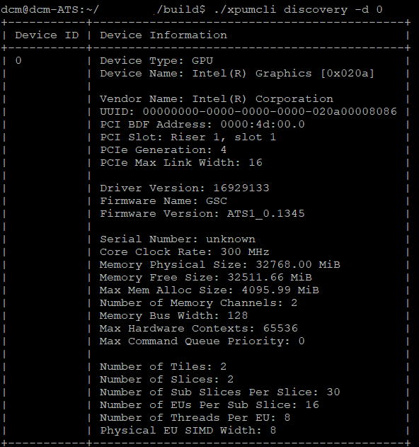
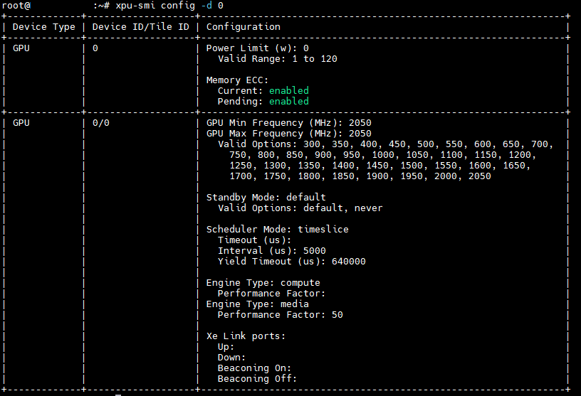

# Intel XPU System Management Interface
Intel XPU System Management Interface is an in-band node-level tool that provides local GPU management. It is easily integrated into the cluster management solutions and cluster scheduler. GPU users may use it to manage Intel GPUs, locally. 
It supports local command line interface and local library call interface. 

## Intel XPU System Management Interface feature
* Provide GPU basic information, including GPU model, frequency, GPU memory capacity, firmware version
* Provide lots of GPU telemetries, including GPU utilization, performance metrics, GPU memory bandwidth, temperature
* Provide GPU health status, memory health, temperature health
* GPU diagnostics through different levels of GPU test suites
* GPU firmware update
* Get/change GPU settings, including power limit, GPU frequency, standby mode and scheduler mode
* Support K8s and can export GPU telemetries to Prometheus

## Supported Devices
* Intel Data Center GPU

## Supported OSes
* Ubuntu 20.0.4
* CentOS Stream 8
  

## Intel XPU System Management Interface Command Line Interface
* Show GPU basic information

  

* Change GPU settings

  
  
## Intel XPU System Management Interface Installation
Please follow [XPU System Management Interface Installation Guide](doc/Install_guide.md) to install/uninstall Intel XPU System Management Interface. 

### Start to use Intel XPU System Management Interface
By default, Intel XPU System Management Interface is installed the folder, /opt/xpum. The command line tool is /opt/xpum/bin/xpu-smi. Please refer to [XPU System Management Interface CLI User Guide](doc/CLI_user_guide.md) for how to use the command line tool. 
