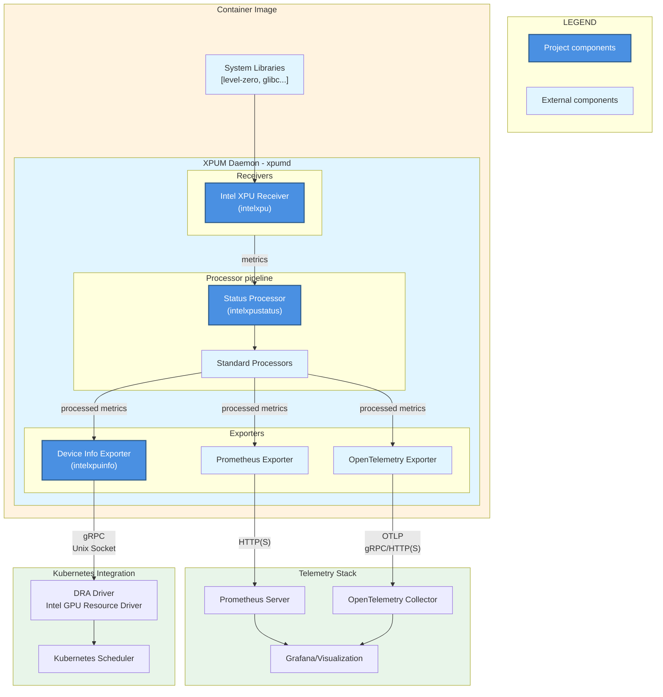

# XPUM Daemon

XPUM (v2.x) daemon is a custom
[OpenTelemetry Collector](https://opentelemetry.io/docs/collector/) that
provides:

* Intel GPU metrics
* GPU capability and health information for Kubernetes Intel GPU resource drivers

[Changes](CHANGES.md) lists differences in corresponding functionality compared to XPUM v1.x.


## Architecture


```mermaid
graph TB
    subgraph LEGEND
        LEGEND_PROJECT["Project components"]
	LEGEND_EXTERNAL["External components"]
    end

    subgraph CONT["Container Image"]
        SYSTEM_LIBRARIES["System Libraries<br/>[level-zero, glibc...]"]

        subgraph XPUMD["XPUM Daemon - xpumd"]
            subgraph RECV["Receivers"]
                RECV_XPU["Intel XPU Receiver<br/>(intelxpu)"]
            end

            subgraph PROC["Processor pipeline"]
                PROC_XPU["Status Processor<br/>(intelxpustatus)"]
                PROC_OTHERS["Standard Processors"]
            end

            PROC_XPU --> PROC_OTHERS

            subgraph EXP["Exporters"]
                EXP_INFO["Device Info Exporter<br/>(intelxpuinfo)"]
                EXP_PROM["Prometheus Exporter"]
                EXP_OTEL["OpenTelemetry Exporter"]
            end

            PROC_OTHERS -->|processed metrics| EXP_INFO
            PROC_OTHERS -->|processed metrics| EXP_PROM
            PROC_OTHERS -->|processed metrics| EXP_OTEL
        end
    end

    subgraph TELEM["Telemetry Stack"]
        PROM["Prometheus Server"]
        OTEL_COL["OpenTelemetry Collector"]
        GRAFANA["Grafana/Visualization"]
    end

    subgraph K8S["Kubernetes Integration"]
        DRA["DRA Driver<br/>Intel GPU Resource Driver"]
        SCHEDULER["Kubernetes Scheduler"]
    end

    SYSTEM_LIBRARIES --> RECV_XPU
    RECV -->|metrics| PROC_XPU

    EXP_PROM -->|"HTTP(S)"| PROM
    EXP_OTEL -->|"OTLP<br/>gRPC/HTTP(S)"| OTEL_COL
    PROM --> GRAFANA
    OTEL_COL --> GRAFANA

    EXP_INFO -->|"gRPC<br/>Unix Socket"| DRA
    DRA --> SCHEDULER

    style LEGEND_PROJECT fill:#4a90e2,stroke:#2e5c8a,stroke-width:2px,color:#fff
    style LEGEND_EXTERNAL fill:#e1f5ff
    style SYSTEM_LIBRARIES fill:#e1f5ff
    style XPUMD fill:#e1f5ff
    style PROC_OTHERS fill:#e1f5ff
    style EXP_PROM fill:#e1f5ff
    style EXP_OTEL fill:#e1f5ff
    style CONT fill:#fff3e0
    style K8S fill:#e8f5e9
    style TELEM fill:#e8f5e9
    style RECV_XPU fill:#4a90e2,stroke:#2e5c8a,stroke-width:2px,color:#fff
    style PROC_XPU fill:#4a90e2,stroke:#2e5c8a,stroke-width:2px,color:#fff
    style EXP_INFO fill:#4a90e2,stroke:#2e5c8a,stroke-width:2px,color:#fff
```


## Deployment

See the [Helm chart](charts/xpumd/README.md) for deployment instructions.

For an example of a more complete telemetry stack, see either:

* [MONITORING.md](MONITORING.md) for using XPUM daemon with Prometheus + Grafana, or
* [OTEL_STACK.md](OTEL_STACK.md) for deploying XPUM daemon with an OpenTelemetry collector backend


## Metrics

See the [`intelxpu` receiver documentation](receiver/sysman/documentation.md)
for the list of available GPU metrics and attributes.

## Device info exporter

The XPUM daemon implements a custom exporter that exposes GPU health
information. It serves a custom gRPC API at local Unix socket
(`/run/xpumd/intelxpuinfo.sock` by default).

The device info exporter is enabled by the default configuration file
([`config-example.yaml`](config-example.yaml)) and the Helm chart.

## Development

### Building

Clone the repository and build the daemon.

```bash
git clone https://github.com/intel/xpumd xpumd
cd xpumd
make build
```

Run:

```bash
./dist/xpumd --config config-example.yaml
```

In another terminal, test the metrics endpoint:

```bash
curl --no-progress-meter http://localhost:8080/metrics
```

### Testing device info exporter

Build the project as described above and start the daemon:

```bash
sudo ./dist/xpumd --config config-example.yaml
```

In another terminal, run the test client to receive device health information:
```
$ sudo ./dist/xpuinfo-cli
info:
    uuid: 8680457d-0800-0000-0002-000000000000
    model: Intel(R) Graphics
    pci: null
health:
    - name: memory
      status: 0
...
```

### Building container image

**NOTE:** Level-Zero Go bindings repository must be cloned inside the `xpumd` source tree.

```bash
docker build -t registry.local/xpumd:main .
```

Test the container image:

```bash
docker run --rm --publish 8080:8080 --device /dev/dri --user 0:0 --cap-drop ALL registry.local/xpumd:main --config /etc/xpumd/config-example.yaml
```

```bash
curl --no-progress-meter http://localhost:8080/metrics
```

### Extracting (L)GPL source packages from container image

For (L)GPL compliance, the container image includes source packages in the
`/sources` directory for (L)GPL-licensed packages that were added on top of the
Ubuntu base image.

To extract these sources from the container (the locally built image used as an
example here):

```bash
# List available source packages
docker run --rm --entrypoint=ls registry.local/xpumd:main -lh /sources

# Copy source packages from the container
docker create --name xpumd-temp registry.local/xpumd:main
docker cp xpumd-temp:/sources ./sources
docker rm xpumd-temp
```

### Testing in single-node cluster

After building the container image, load the image onto the cluster. E.g.
with containerd:

```bash
docker save registry.local/xpumd:main  -o xpum-main.tar
sudo ctr -n k8s.io images  import xpum-main.tar
rm xpum-main.tar
```

Deploy the image with the Helm chart:

```bash
helm install xpumd charts/xpumd --set image.repository=registry.local/xpumd --set image.pullPolicy=Never
```
