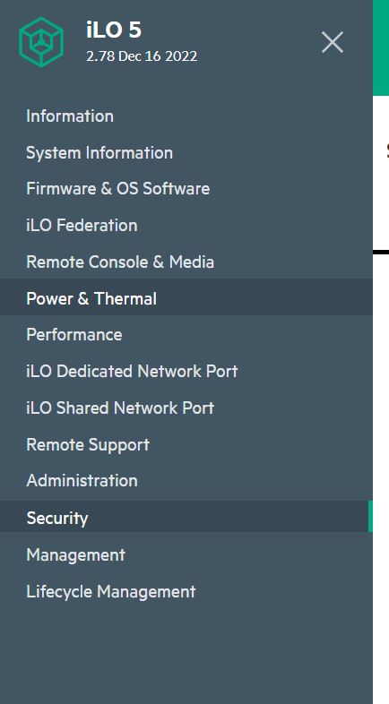
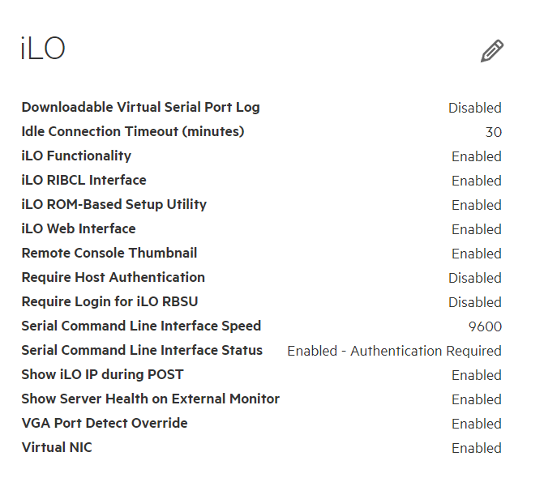

# 1.Prerequisites 

You need driver module "cdc_eem" to support the Virtual NIC. 
Enter the following command to check if cdc_eem is loaded:
```
lsmod | grep cdc_eem
```

# 2.Enable Virtual NIC from BMC

2.1 Login iLO console, and select "Security" tab.



2.2 Edit iLO settings, by enabling the Virtual NIC option



2.3 Reset the system to take effect.

# 3.Configure network interface for Virtual NIC

If your Linux distribution does not automatically configure network interface for Virtual NIC, you can configure manually by following procedure.

3.1 Check idVendor and idProduct info using dmidecode:
```
dmidecode -t 42
```
Output may be like:
```
# dmidecode 3.2
Getting SMBIOS data from sysfs.
SMBIOS 3.2.1 present.
# SMBIOS implementations newer than version 3.2.0 are not
# fully supported by this version of dmidecode.

Handle 0x0065, DMI type 42, 123 bytes
Management Controller Host Interface
        Host Interface Type: Network
        Device Type: USB
                idVendor: 0x03f0
                idProduct: 0x2927
                Protocol ID: 04 (Redfish over IP)
                        Service UUID: xxxxxxxx-xxxx-xxxx-xxxx-xxxxxxxxxxxx
                        Host IP Assignment Type: DHCP
                        Host IP Address Format: IPv4
                        Redfish Service IP Discovery Type: DHCP
                        Redfish Service IP Address Format: IPv4
                        Redfish Service Hostname: XXXXXXXXXXXX.
```

3.2 To identify the device in /sys/bus/usb/devices, run below commands:

```
tail /sys/bus/usb/devices/*/idVendor

tail /sys/bus/usb/devices/*/idProduct
```

For example, /sys/bus/usb/devices/1-4 shows the same value:
```
==> /sys/bus/usb/devices/1-4/idVendor <==
03f0
==> /sys/bus/usb/devices/1-4/idProduct <==
2927
```

3.3 Check the interface name, for example usb0
```
ls /sys/bus/usb/devices/1-4/*/net
```

3.4 Configure the interface
```
ifconfig usb0 up
dhclient usb0
```

3.5 Check if configuring has taken effect. If the interface has inet 16.1.15.2, means it is configured successfully.
```
ifconfig
```
For exmaple, output may be like:
```
usb0: flags=4163<UP,BROADCAST,RUNNING,MULTICAST>  mtu 1500
        inet 16.1.15.2  netmask 255.255.255.252  broadcast 16.1.15.3
        inet6 fe80::488d:d6ff:fe7b:5aca  prefixlen 64  scopeid 0x20<link>
        ether 4a:8d:d6:7b:5a:ca  txqueuelen 1000  (Ethernet)
        RX packets 963  bytes 394762 (394.7 KB)
        RX errors 0  dropped 0  overruns 0  frame 0
        TX packets 1476  bytes 518954 (518.9 KB)
        TX errors 0  dropped 0 overruns 0  carrier 0  collisions 0
```

# 4.References:
- https://hewlettpackard.github.io/ilo-rest-api-docs/ilo5/#using-the-virtual-nic
- https://support.hpe.com/hpesc/public/docDisplay?docId=a00105236en_us&page=GUID-434DFBDD-42E7-445C-B9DA-C9BE6512FB0A.html
- https://support.hpe.com/hpesc/public/docDisplay?docId=a00105236en_us&page=GUID-8128AE32-EBD7-49D2-83B4-4F74B5CE5D83.html
