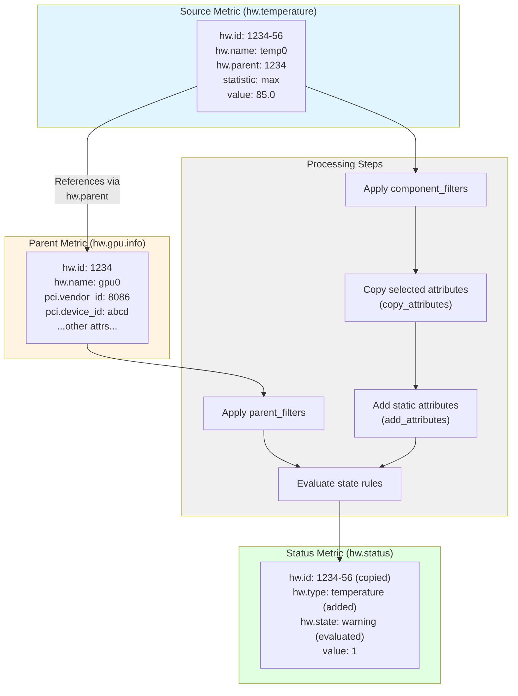

# Intel XPU Status Processor

## Overview

The Intel XPU Status Processor generates status metrics by evaluating metrics
against configurable rules. The status evaluation includes parent component
attributes which enables more context-aware processing.

The processor is designed for generating hardware status metrics and the generated status metric
follows the conventions of
[`hw.status` metric](https://opentelemetry.io/docs/specs/semconv/hardware/common/#metric-hwstatus)
defined in the OpenTelemetry specification.

**Key features:**
- Transforms component metrics (e.g., temperature or utilization) into (health) status metrics
- Two-level hierarchical component relationships (e.g., temperature sensor -> GPU device)
- Flexible rule-based evaluation of status/state evaluation

## Configuration

### Basic Structure

This example demonstrates all available configuration fields:

```yaml
processors:
  intelxpustatus:
    rules:
      - name: "Memory temperature health"
        source_metric: "hw.temperature"
        parent_metric: "hw.gpu.info"
        status_metric: "hw.status"
        parent_ref_attribute: "hw.parent"
        parent_id_attribute: "hw.id"
        state_attribute: "hw.state"
        copy_attributes:
          - "hw.id"
          - "hw.type"
        add_attributes:
          hw.category: "monitoring"
        component_filters:
          - key: "hw.sensor_location"]
            values: ["gpu"]
        parent_filters:
          - key: "hw.type"
            values: ["memory"]
        states:
          - state_name: "ok"
          - state_name: "warning"
            conditions:
              - value: 85.0
          - state_name: "critical"
            conditions:
              - value: 95.0
                parent_filters:
                  - key: "hw.model"
                    values: ["modelA", "modelB"]
```

### Configuration Parameters

#### HealthRule

| Parameter | Type | Default | Description |
|-----------|------|---------|-------------|
| `name` | string | *required* | Name of the rule for identification and logging purposes |
| `source_metric` | string | *required* | Source metric to evaluate the state rules against |
| `parent_metric` | string | "" | Parent metric to get the parent attributes from. If empty, no parent filtering is applied |
| `status_metric` | string | "hw.status" | Metric to set the status on |
| `id_attribute` | string | "hw.id" | Attribute that uniquely identifies the hardware component within `source_metric` |
| `parent_ref_attribute` | string | "hw.parent" | Attribute of the `source_metric` that identifies the parent of the hardware component |
| `parent_id_attribute` | string | "hw.id" | Attribute of the parent metric that uniquely identifies the parent and to which the `parent_ref_attribute` points to |
| `state_attribute` | string | "hw.state" | Attribute of the `status_metric` to set the state on |
| `copy_attributes` | []string | [] | List of attributes to copy from `source_metric` to `status_metric` |
| `add_attributes` | map[string]string | {} | Additional attributes to set on the `status_metric` |
| `component_filters` | []AttributeFilter | [] | Filters to apply on the source metric |
| `parent_filters` | []AttributeFilter | [] | Filters to apply on the parent metric |
| `states` | []StateRule | *required* | Ordered list of state rules to evaluate. All rules are evaluated, and the last matching one will be active. Thus, the rules should be ordered by increasing severity |

#### AttributeFilter

```yaml
component_filters:
  - key: "hw.sensor_location"
    values: ["board", "memory"]
```

| Parameter | Type | Description |
|-----------|------|-------------|
| `key` | string | Attribute key to filter on |
| `values` | []string | Attribute values to match (logical OR) |

#### StateRule

```yaml
states:
  - state_name: "warning"
    conditions:
      - value: 85.0
        parent_filters:
          - key: "hw.vendor"
            values: ["Intel"]
```

| Parameter | Type | Description |
|-----------|------|-------------|
| `state_name` | string | Value to set to the state attribute (`state_attribute`) of the generated metric (`status_metric`) |
| `conditions` | []ConditionRule | Conditions to evaluate to apply this state. A logical OR is applied i.e. the rule matches if any of the conditions match. Empty list means always match |

#### ConditionRule

| Parameter | Type | Description |
|-----------|------|-------------|
| `value` | float64 | Value threshold. Condition matches if metric value >= threshold |
| `parent_filters` | []AttributeFilter | Filter to apply on parent attributes |

### Example Configuration

```yaml
processors:
  intelxpustatus:
    rules:
      # GPU memory temperature monitoring
      - name: "GPU memory temperature"
        # Read temperature values from memory components
        source_metric: "hw.temperature"
        # Parent metadata, GPU device (vendor, model, etc.)
        parent_metric: "hw.gpu.info"
        # Output as standardized health status metric
        status_metric: "hw.status"
        # Preserve component identity from source metric
        copy_attributes:
          - "hw.id"
          - "hw.type"
        # Add custom classification attribute
        add_attributes:
          hw.category: "thermal"
        # Only process memory on Intel(R) GPUs
        parent_filters:
          - key: "pci.vendor_id"
            values: ["8086"]
        # State rules evaluated in order; last match wins
        states:
          # Default state when no other conditions match
          - state_name: "ok"
          # Warning (overrides ok)
          - state_name: "warning"
            conditions:
              # Set warning for temp >= 85C
              - value: 85.0
          # Critical (overrides warning)
          - state_name: "critical"
            conditions:
              # Device-specific critical threshold
              - value: 90.0
                parent_filters:
                  - key: "hw.device_id"]
                    values: ["abcd", "1234"]
              # Default critical for temp >= 95C
              - value: 95.0
```

For a `hw.temperature` metric  with a value 87.0 C you would get:

```
hw.status{hw.id="mem0", hw.type="memory", hw.category="thermal", hw.state="ok"} 0
hw.status{hw.id="mem0", hw.type="memory", hw.category="thermal", hw.state="warning"} 1
hw.status{hw.id="mem0", hw.type="memory", hw.category="thermal", hw.state="critical"} 0
```

The processor generates data points for **all defined states**, with value 1 for the active state and 0 for inactive states.

## Metrics processing

The following diagram illustrates how attributes flow from source and parent metrics to the generated status metric:


