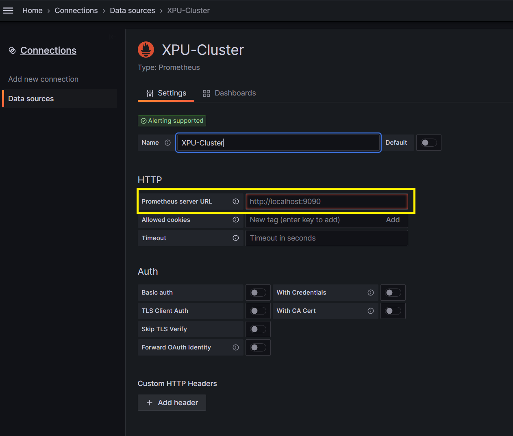
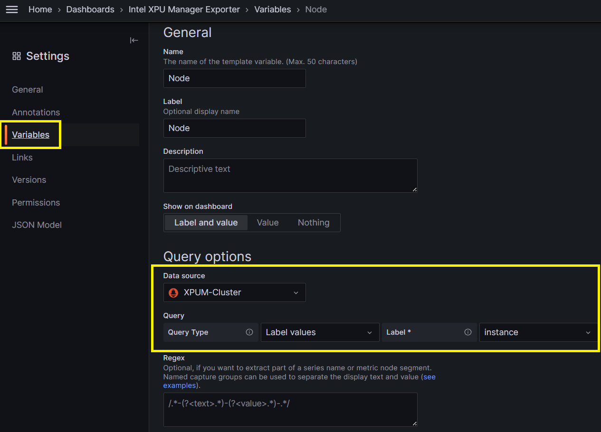

# Grafana dashboard setup guide for XPUM

## Step 1. Enable XPU Manager restful feature
1. Please refer to [Enable XPUM Manager restful feature](README.md).
 
## Step 2. Download and configure Prometheus
 1. Download Prometheus from https://prometheus.io/download/.
 2. Set Prometheus configuration file prometheus.yml as follows. Please change the restful basic_auth password and the target device ip.
 ```
# my global config
global:
  scrape_interval: 15s # Set the scrape interval to every 15 seconds. Default is every 1 minute.
  evaluation_interval: 15s # Evaluate rules every 15 seconds. The default is every 1 minute.
  # scrape_timeout is set to the global default (10s).

# Alertmanager configuration
alerting:
  alertmanagers:
    - static_configs:
        - targets:
          # - alertmanager:9093

# Load rules once and periodically evaluate them according to the global 'evaluation_interval'.
rule_files:
  # - "first_rules.yml"
  # - "second_rules.yml"

# A scrape configuration containing exactly one endpoint to scrape:
# Here it's Prometheus itself.
scrape_configs:
  # The job name is added as a label `job=<job_name>` to any timeseries scraped from this config.
  - job_name: "prometheusi"
    scheme: https
    basic_auth:
            username: 'xpumadmin'
            password: '********'
    tls_config:
            insecure_skip_verify: true


    # metrics_path defaults to '/metrics'
    # scheme defaults to 'http'.

    static_configs:
            - targets: ["<device1 ip>:30000", "<device2 ip>:30000"]

 ``` 
3. Start Prometheus by command as follows.
```
sudo ./prometheus --config.file=./prometheus.yml
```
4. Check that the Prometheus is working properly by URL: http://\<Prometheus server ip>:9090/.

## Step 3. Download and configure Grafana
 1. Download Grafana from https://grafana.com/.
 2. Start Grafana by command as follows.
 ```
 ./grafana server
 ```
 3. Login URL: http://\<Grafana server ip>:3000/ and create the "Connection" to Prometheus as shown below. The default user and password are 'admin'.

 4. Create Grafana dashboard. Please refer to https://grafana.com/docs/grafana/latest/getting-started/get-started-grafana-prometheus/. You can import this [json file](grafana-dashboard.json) when you create Grafana dashboard. Please set a variable "Node" as shown below.
