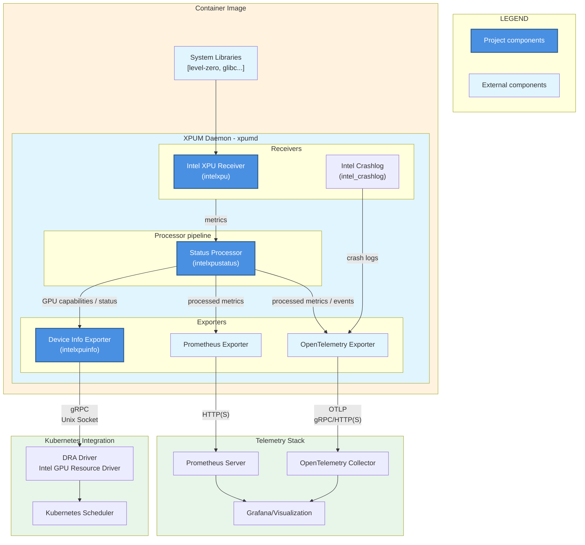

# Intel(R) XPU Manager (XPUM) Daemon

- [Introduction](#introduction)
- [Architecture](#architecture)
- [Deployment](#deployment)
  - [Standalone](#standalone)
  - [Kubernetes](#kubernetes)
  - [Grafana dashboard](#grafana-dashboard)
- [Features](#features)
  - [Metrics](#metrics)
  - [Device info exporter](#device-info-exporter)
- [Development](#development)


## Introduction

XPUM (v2.x) daemon is a custom
[OpenTelemetry Collector](https://opentelemetry.io/docs/collector/) that
provides:

* Intel GPU metric exporters
* GPU status information for Kubernetes Intel GPU resource drivers

[Changes](docs/CHANGES.md) lists differences in corresponding functionality compared to XPUM v1.x.


## Architecture




## Deployment

### Standalone

Run XPUM daemon with its example config (with `$TAG` being the desired release tag):

```bash
docker run -it --rm --user 0 --cap-drop ALL --cap-add SYS_ADMIN \
  --device /dev/dri --publish 8080:8080 ghcr.io/intel/xpumanager/xpumd:$TAG \
  --config /etc/xpumd/config-example.yaml
```

For integration-style runs without a real Level Zero userspace driver, the
image also ships a stub driver. See
[`DEVELOPMENT.md`](docs/DEVELOPMENT.md#testing-container-image-with-stub-driver)
for detailed instructions.

See also [Testing container image](docs/DEVELOPMENT.md#testing-container-image).

### Kubernetes

See the [Helm chart](charts/xpumd/README.md) for deployment instructions.

For an example of a more complete telemetry stack, see either:

* [MONITORING.md](docs/MONITORING.md) for using XPUM daemon with Prometheus + Grafana, or
* [OTEL_STACK.md](docs/OTEL_STACK.md) for deploying XPUM daemon with an OpenTelemetry collector backend

### Grafana dashboard

Helm chart installs Grafana dashboard, but one can also load manually
[dashboard JSON version](charts/xpumd/json/) to Grafana.


## Features

### Metrics

See the [`intelxpu` receiver documentation](receiver/intelxpu/sysman/documentation.md)
for the list of supported GPU metrics and attributes.

Metrics availability depends on the underlying host hardware,
firmware, kernel and its GPU driver version, and the user-space
Level-Zero driver (included in the container image).

That set is further constrained by the host kernel, depending on the
privileges given to the (XPUM daemon) container / process querying the
metrics:

* Writable GPU device files:
  - Docker base options: `--device /dev/dri --cap-drop ALL`
  - Needed for all metrics
* User/group can write to GPU device files:
  - Docker options: `--user 65534:$(awk -F: '/render/{print $3}' /etc/group)`
  - Metrics: power, frequency, memory usage
* User 0:
  - Docker options: `--user 0`
  - Adds metrics: temperature, memory + PCIe bandwidth
* SYS_ADMIN capability:
  - Docker options: `--cap-add SYS_ADMIN`
  - Adds PMU metrics: GPU engine utilization
* Access to MEI devices:
  - Docker options: `--device /dev/mei<idx>`
  - Required for information on subset of the firmware types

### Device info exporter

The XPUM daemon implements a custom exporter that exposes GPU capability and health information.
It serves a custom gRPC API at local Unix socket (`/run/xpumd/intelxpuinfo.sock` by default).

The device info exporter is enabled by the default configuration file
([`config-example.yaml`](config-example.yaml)) and the [Helm chart](charts/xpumd/README.md).


## Development

See [DEVELOPMENT.md](docs/DEVELOPMENT.md) for instructions on how to build, run and test the XPUM daemon.
