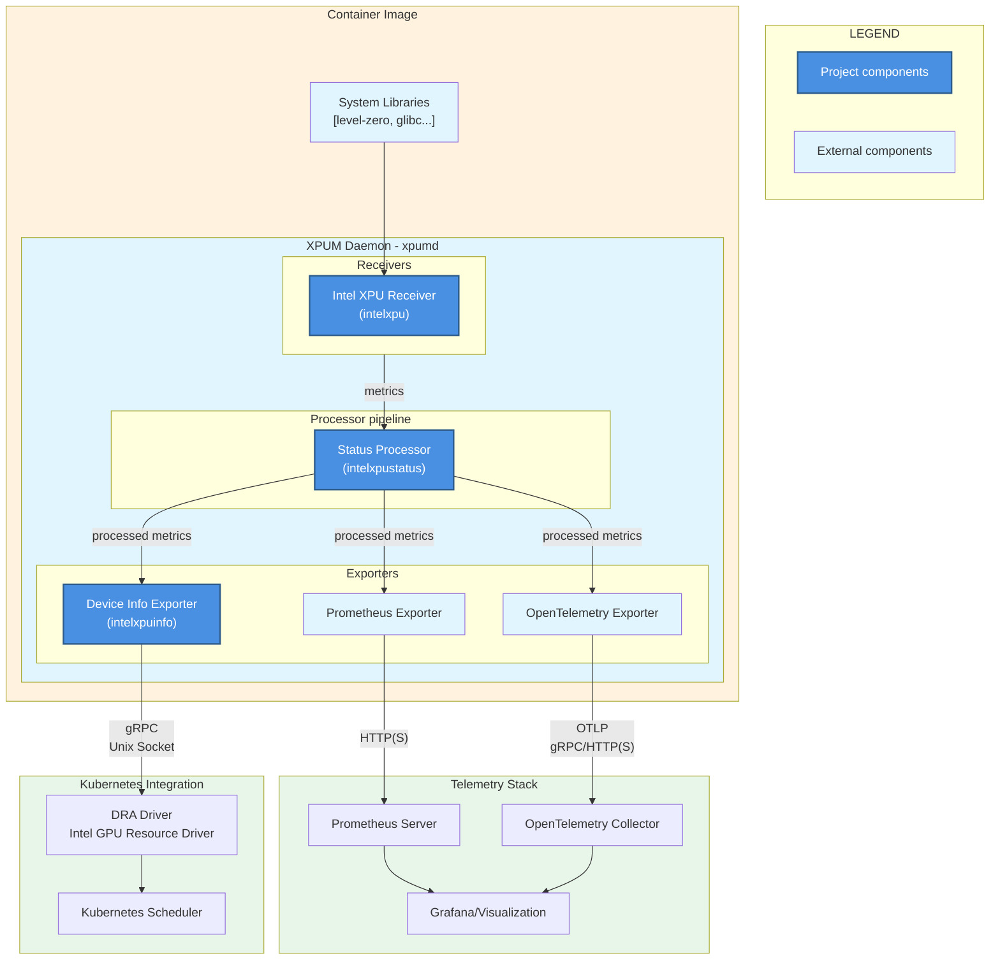
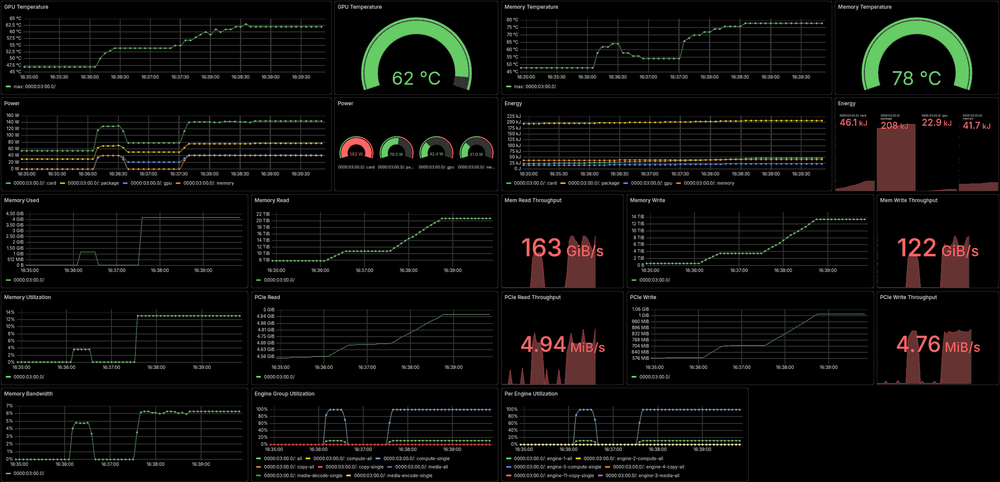

# Intel(R) XPU Manager (XPUM) Daemon

- [Introduction](#introduction)
- [Architecture](#architecture)
- [Deployment](#deployment)
  - [Standalone](#standalone)
  - [Kubernetes](#kubernetes)
  - [Grafana dashboard](#grafana-dashboard)
- [Features](#features)
  - [Metrics](#metrics)
  - [Device info exporter](#device-info-exporter)
- [Development](#development)
  - [Building](#building)
  - [Running](#running)
  - [Testing Prometheus exporter](#testing-prometheus-exporter)
  - [Testing device info exporter](#testing-device-info-exporter)
  - [Building container image](#building-container-image)
  - [Testing container image](#testing-container-image)
  - [Extracting sources from container image](#extracting-sources-from-container-image)
  - [Testing in single-node cluster](#testing-in-single-node-cluster)


## Introduction

XPUM (v2.x) daemon is a custom
[OpenTelemetry Collector](https://opentelemetry.io/docs/collector/) that
provides:

* Intel GPU metric exporters
* GPU status information for Kubernetes Intel GPU resource drivers

[Changes](CHANGES.md) lists differences in corresponding functionality compared to XPUM v1.x.


## Architecture




## Deployment

### Standalone

Run XPUM daemon with its example config (with `$TAG` being the desired release tag):

```bash
docker run -it --rm --user 0 --cap-drop ALL --cap-add SYS_ADMIN \
  --device /dev/dri --publish 8080:8080 ghcr.io/intel/xpumanager/xpumd:$TAG \
  --config /etc/xpumd/config-example.yaml
```

See also [Testing container image](#testing-container-image).

### Kubernetes

See the [Helm chart](charts/xpumd/README.md) for deployment instructions.

For an example of a more complete telemetry stack, see either:

* [MONITORING.md](MONITORING.md) for using XPUM daemon with Prometheus + Grafana, or
* [OTEL_STACK.md](OTEL_STACK.md) for deploying XPUM daemon with an OpenTelemetry collector backend

### Grafana dashboard

Helm chart installs Grafana dashboard, but one can also load manually
[dashboard JSON version](charts/xpumd/json/) to Grafana.




## Features

### Metrics

See the [`intelxpu` receiver documentation](receiver/sysman/documentation.md)
for the list of supported GPU metrics and attributes.

Metrics availability depends on the underlying host hardware,
firmware, kernel and its GPU driver version, and the user-space
Level-Zero driver (included in the container image).

That set is further constrained by the host kernel, depending on the
privileges given to the (XPUM daemon) container / process querying the
metrics:

* Writable GPU device files:
  - Docker base options: `--device /dev/dri --cap-drop ALL`
  - Needed for all metrics
* User/group can write to GPU device files:
  - Docker options: `--user 65534:$(awk -F: '/render/{print $3}' /etc/group)`
  - Metrics: power, frequency, memory usage
* User 0:
  - Docker options: `--user 0`
  - Adds metrics: temperature, memory + PCIe bandwidth
* SYS_ADMIN capability:
  - Docker options: `--cap-add SYS_ADMIN`
  - Adds PMU metrics: GPU engine utilization
* Access to MEI devices:
  - Docker options: `--device /dev/mei<idx>`
  - Required for information on subset of the firmware types

### Device info exporter

The XPUM daemon implements a custom exporter that exposes GPU health
information. It serves a custom gRPC API at local Unix socket
(`/run/xpumd/intelxpuinfo.sock` by default).

The device info exporter is enabled by the default configuration file
([`config-example.yaml`](config-example.yaml)) and the [Helm chart](charts/xpumd/README.md).


## Development

### Building

Clone the repository:

```bash
git clone https://github.com/intel/xpumanager
```

Switch to it:

```bash
cd xpumanager/xpumd
```

And build the daemon:

```bash
make build
```

### Running

```bash
sudo ./dist/xpumd --config config-example.yaml
```

(Extra privileges are required to get all the metrics, but some of them
are available also without `sudo`, see [Metrics](#metrics).)

### Testing Prometheus exporter

In another terminal:

```bash
curl --no-progress-meter http://localhost:8080/metrics
```

### Testing device info exporter

In another terminal, run the test client to receive device health information and changes:

```bash
sudo ./dist/xpuinfo-cli
```

Its output should look something like this:

```bash
info:
    uuid: 8680457d-0800-0000-0002-000000000000
    model: Intel(R) Graphics
    pci: null
health:
    - name: memory
      status: 0
...
```

### Building container image

```bash
docker build -t registry.local/xpumd:main .
```

### Testing container image

Test the container with example config from the image:

```bash
docker run -it --rm --user 0 --cap-drop ALL --cap-add SYS_ADMIN \
  --device /dev/dri --publish 8080:8080 registry.local/xpumd:main \
  --config /etc/xpumd/config-example.yaml
```

One can also modify the config, e.g. to drop the local gRPC health endpoint:

```bash
sed -i s/intelxpuinfo,// config-example.yaml
```

Map the modified config inside container, and ask daemon to use it:

```bash
docker run -it --rm --user 0 --cap-drop ALL --cap-add SYS_ADMIN \
  --volume $PWD/config-example.yaml:/etc/xpumd/config.yaml:ro \
  --device /dev/dri --publish 8080:8080 registry.local/xpumd:main \
  --config /etc/xpumd/config.yaml
```

(If running on a distro with SELinux enabled, and `docker` being
provided by `podman` i.e. container being run with normal user
privileges, add `--security-opt label=disable` option.)

Query Prometheus metrics:

```bash
curl --no-progress-meter http://localhost:8080/metrics
```

### Extracting sources from container image

For (L)GPL compliance, the container image includes source packages in the
`/sources` directory for (L)GPL-licensed packages that were added on top of the
Ubuntu base image.

To extract these sources from the container image (locally built one is used as an
example here):

1. Run image in a temporary container:

```bash
docker create --name xpumd-temp registry.local/xpumd:main
```

2. Extract sources from it:

```bash
docker cp xpumd-temp:/sources ./sources
```

3. And remove the container:

```bash
docker rm xpumd-temp
```

4. List the source packages:

```bash
ls -lh ./sources
```

### Testing in single-node cluster

After building the container image, load the image onto the cluster. E.g.
with containerd:

1. Save image as a tarball (on build machine):

```bash
docker save registry.local/xpumd:main  -o xpum-main.tar
```

2. Import tarball to container runtime (on cluster node):

```bash
sudo ctr -n k8s.io images  import xpum-main.tar
```

(`-n k8s.io` option is needed for images to be visible to Kubernetes / `crictl`.)

Then see [Helm chart README](charts/xpumd/README.md) on how to deploy the new image.
