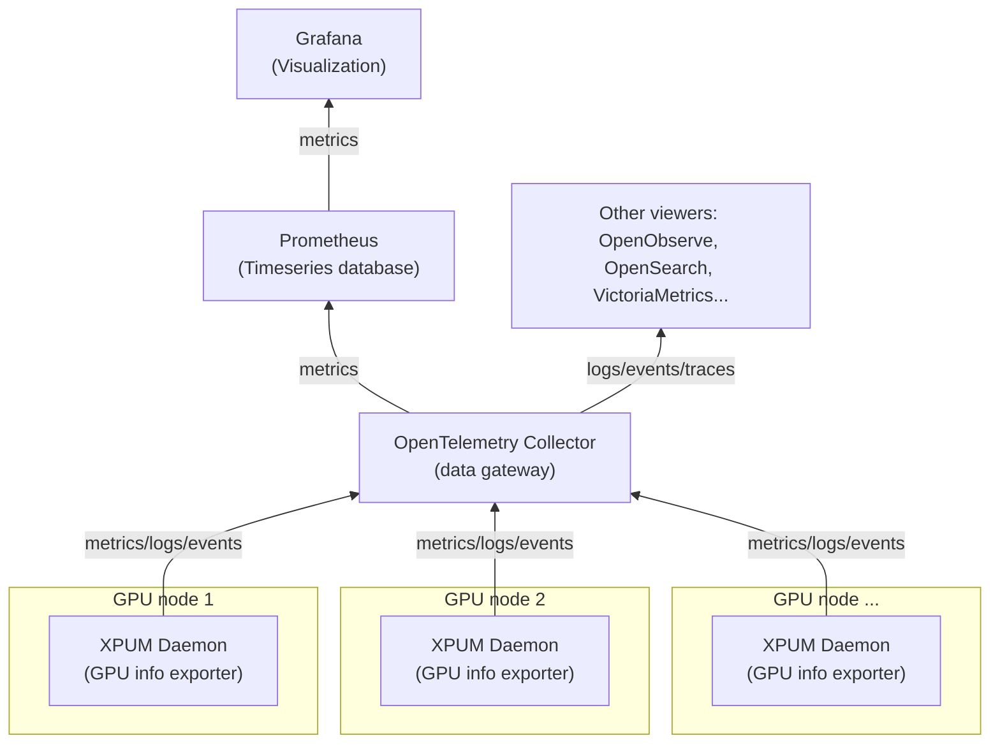

# Deploying XPUM Daemon with OpenTelemetry Collector

## Overview

This guide demonstrates how to deploy XPUM daemon (`xpumd`) with an upstream
OpenTelemetry Collector to build a more complete observability stack. In this
example setup:

- [**Upstream OpenTelemetry Collector**](#step-1-deploy-upstream-opentelemetry-collector)
  receives metrics from `xpumd` and provides Prometheus-compatible endpoints
- [**xpumd**](#step-2-deploy-xpumd)
  collects Intel GPU telemetry and exports metrics via OTLP (OpenTelemetry Protocol)
- [**Prometheus/Grafana**](#visualization-with-grafana)
  (optional) used for visualization and alerting

> [!CAUTION]
> This guide is for demonstration purposes only. For production deployments,
> consider security, scaling, and reliability aspects. See
> [configuration best practices](https://opentelemetry.io/docs/security/config-best-practices/).


## Deployment Steps

### Step 1: Deploy Upstream OpenTelemetry Collector

Add the OpenTelemetry Helm repository:

```bash
helm repo add open-telemetry https://open-telemetry.github.io/opentelemetry-helm-charts
helm repo update
```

Create a values file for the upstream collector (`otel-collector-values.yaml`):

```yaml
mode: deployment

image:
  repository: otel/opentelemetry-collector

# OTLP receiver is enabled by default
config:
  exporters:
    prometheus:
      endpoint: 0.0.0.0:8889

  service:
    pipelines:
      metrics:
        receivers: [otlp]
        processors: [memory_limiter, batch]
        exporters: [prometheus]

ports:
  prometheus:
    enabled: true
    containerPort: 8889
    servicePort: 8889
    protocol: TCP
```

Deploy the upstream collector:

```bash
helm install otel-collector open-telemetry/opentelemetry-collector -f otel-collector-values.yaml
```

### Step 2: Deploy xpumd

Install `xpumd` with the OTLP exporter configured to send metrics to the upstream collector.

With locally built image (e.g. [kind](https://kind.sigs.k8s.io/) cluster):

```bash
helm install xpumd charts/xpumd \
  --set image.repository=registry.local/xpumd \
  --set image.pullPolicy=Never \
  --set config.exporters.otlphttp.endpoint="http://otel-collector-opentelemetry-collector.default.svc.cluster.local:4318" \
  --set config.service.pipelines.metrics.exporters="{intelxpuinfo,otlphttp}"
```

From ghcr.io registry:

```bash
helm install xpumd oci://ghcr.io/intel/xpumanager/charts/xpumd \
  --set config.exporters.otlphttp.endpoint="http://otel-collector-opentelemetry-collector.default.svc.cluster.local:4318" \
  --set config.service.pipelines.metrics.exporters="{intelxpuinfo,otlphttp}" \
  --version 0.0.0-latest
```

Alternatively, use the OTLP gRPC exporter (port 4317) instead of HTTP.

> [!IMPORTANT]
> See the [Chart README](../charts/xpumd/README.md) for details on how to
> configure `xpumd` for the target cluster setup.

### Step 3: Validate the Setup

**1. Check pod status:**

```bash
kubectl get pods
```

Ensure both `xpumd` and `otel-collector-opentelemetry-collector` pods are running.

**2. Query metrics from the Prometheus endpoint:**

Port-forward the upstream collector's Prometheus endpoint:

```bash
kubectl port-forward svc/otel-collector-opentelemetry-collector 8889:8889
```

In another terminal, fetch the metrics:

```bash
curl --no-progress-meter http://localhost:8889/metrics
```

Look for Intel GPU metrics, e.g.:

- `hw_gpu_info`
- `hw_status`
- `hw_frequency_hertz`
- `hw_memory_usage_bytes`

> [!NOTE]
> See the [`intelxpu` receiver documentation](../receiver/intelxpu/sysman/documentation.md)
> for all available metrics.

## Visualization with Grafana

Visualization requires metrics to be stored in a timeseries database, and Prometheus is a popular choice for that.

The [MONITORING.md](MONITORING.md) document has instructions on installing Prometheus / Grafana, and
the [Helm chart documentation](../charts/xpumd/README.md) explains how to enable `xpumd` dashboard for Grafana
(`xpumd` Prometheus integration should not be enabled for this setup, only the Grafana dashboard).

If a larger amount of data is collected, configuring OpenTelemetry Collector with
the `prometheusremotewrite` instead of the `prometheus` exporter one may be preferred:
https://grafana.com/blog/a-practical-guide-to-data-collection-with-opentelemetry-and-prometheus/#6-use-prometheus-remote-write-exporter


